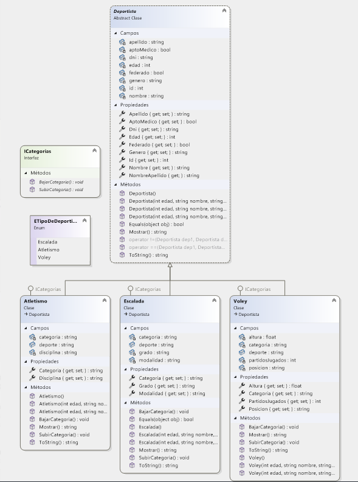
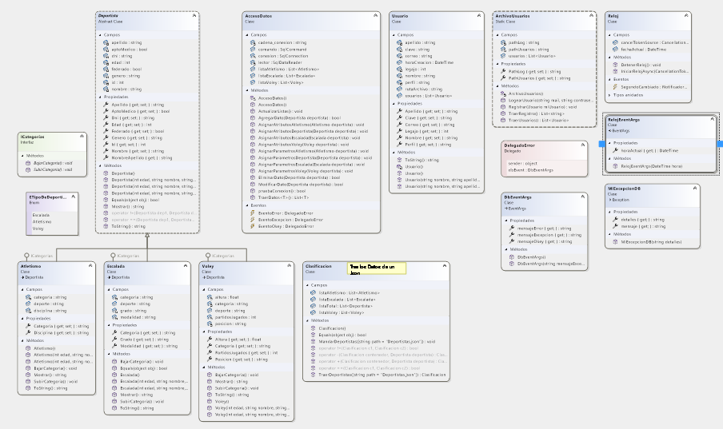

# Etchart.JuanPablo.SegundoParcial

## Descripción del Proyecto

Este proyecto, denominado "Etchart.JuanPablo.SegundoParcial", está diseñado para gestionar y clasificar deportistas en tres categorías: escalada, atletismo y vóley. La aplicación, desarrollada en C# utilizando Windows Forms, incorpora funcionalidades de Crear, Leer, Actualizar y Eliminar (CRUD) para administrar la información de los deportistas.

## Estructura del Proyecto

### Clases

El sistema se basa en cuatro partes principales de clases:

1. **Clase Deportista:**
   - Hereda a tres clases específicas: Atletismo, Voley y Escalada. Representa a los jugadores que pueden registrarse en la aplicación.

2. **Usuarios:**
   - Gestiona el acceso a la aplicación, asignando funciones según la jerarquía del usuario.

3. **Clasificación:**
   - Agrupa a cada clase de deportistas, los ordena y compara sus valores para distribuirlos y mostrarlos de manera adecuada.

4. **Acceso a la Base de Datos:**
   - Se encarga de traer y enviar los datos mediante una base de datos SQL Server, gestionando la información de usuarios y deportistas.

## Características de la Aplicación

### Agregar Deportistas
Los usuarios pueden ingresar información detallada sobre los deportistas, incluyendo nombre, apellido, edad, género, estado médico y si están federados. Además, se pueden proporcionar detalles específicos según el deporte.

### Clasificar Deportistas
La aplicación clasifica automáticamente a los deportistas en una de las tres categorías según su deporte.

### Visualizar Deportistas
Los usuarios pueden consultar una lista de deportistas clasificados por categoría.

### Modificar Deportistas
Se proporciona la capacidad de editar la información de un deportista existente.

### Eliminar Deportistas
Los usuarios pueden eliminar deportistas de la lista.

## Requisitos del Sistema

- Sistema operativo Windows.
- Entorno de desarrollo Microsoft Visual Studio con soporte para aplicaciones C#.
- Servidor SQL Server.

## Instrucciones de Uso

1. Descarga o clona el repositorio desde GitHub y guárdalo en tu máquina local.
2. Abre el proyecto en Microsoft Visual Studio.
3. Abre sqlManagment studio
-opcionA:Ejecuta el script `deportistas.sql` en tu servidor SQL Server para crear la base de datos y las tablas necesarias.
-opcionB:Realiza un atach con los archivos del tipo mdf y ldf
4. Configura la cadena de conexión a la base de datos en las propiedades de la aplicación.
5. Compila y ejecuta la aplicación.
6. Sigue las instrucciones en la interfaz de Windows Form para agregar, clasificar, visualizar, modificar o eliminar deportistas.

Ahora, la aplicación utiliza una base de datos SQL Server en lugar de archivos para almacenar la información de los deportistas.
